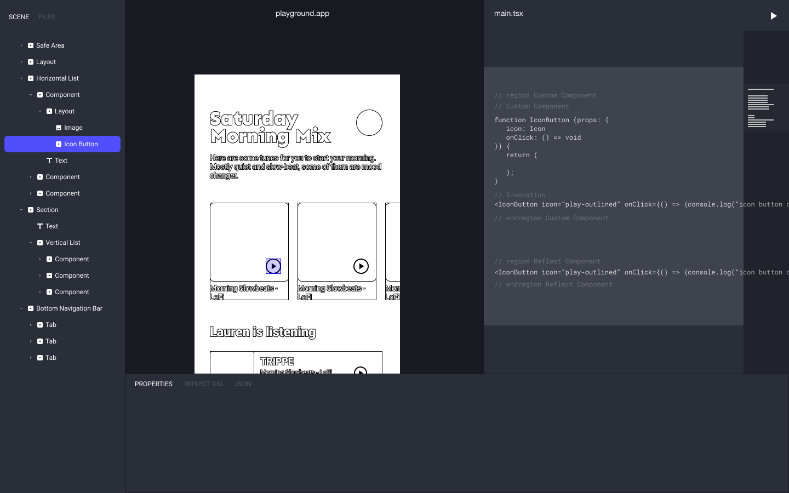
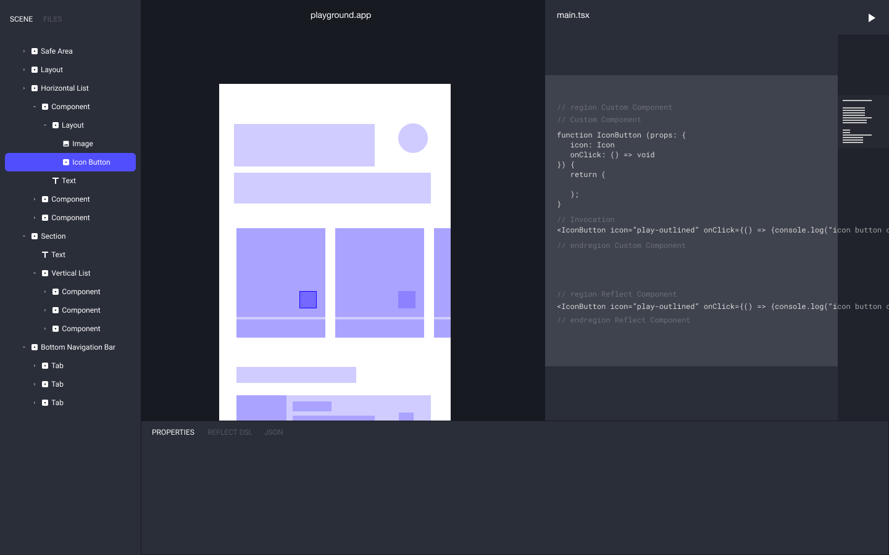
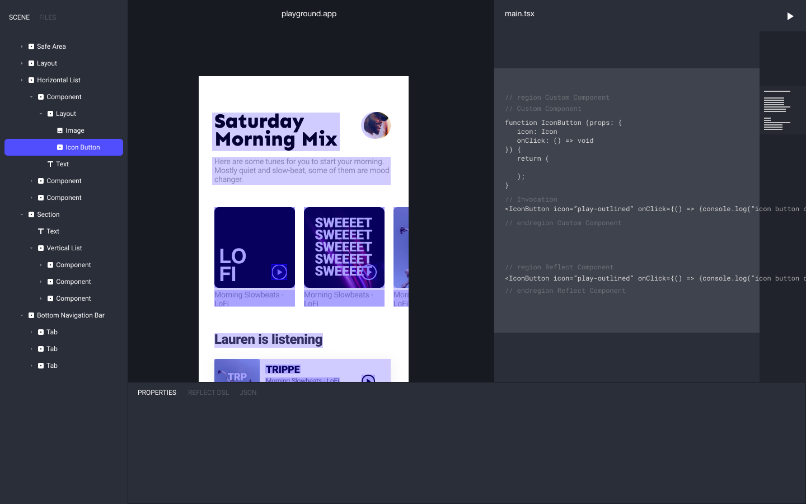
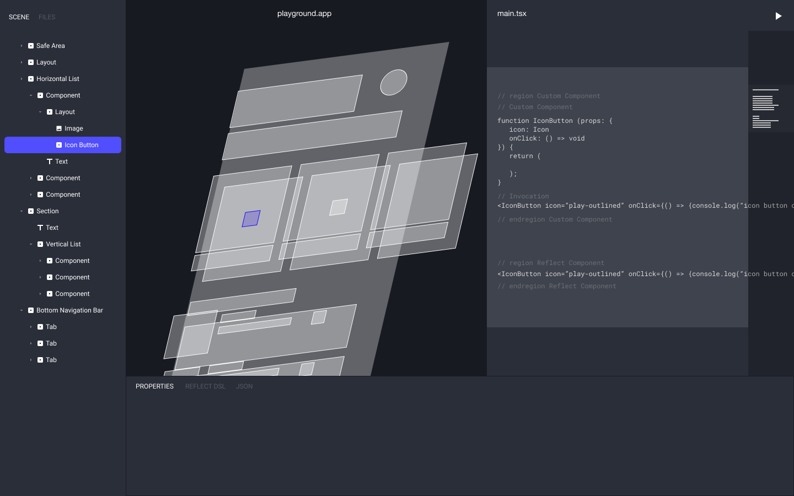
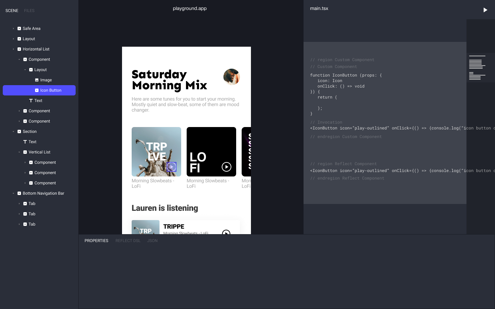
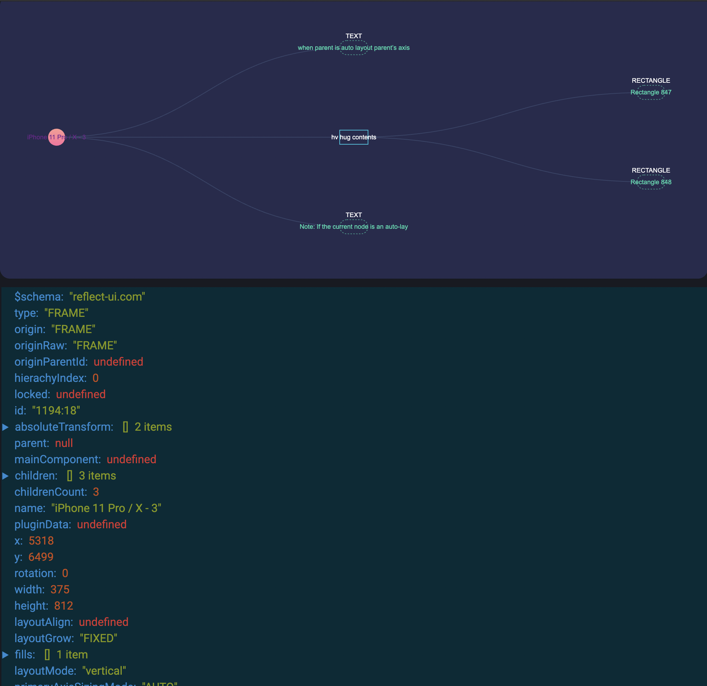

# Design to code

https://user-images.githubusercontent.com/16307013/145498355-58fb2cf3-a6a0-44a3-8515-3859b048c3a4.mov

Design to code engine. A design ✌️ code standard.

> Grida's Design to code core library. Convert your figma, sketch and adobe xd design to flutter, react, vue and more.

## Demo

for the demo, please visit [assistant](https://github.com/gridaco/assistant)

For the fully integrated working demo, visit [grida.co](https://grida.co)

### Run it your own

```
git clone https://github.com/gridaco/designto-code.git

cd designto-code
yarn
yarn editor
# visit http://localhost:6626
```

update pulling - `git submodule update --init --recursive`

## Platforms / Frameworks

| **Frameworks**     |       |
| ------------------ | :---: |
| ReactJS            |  ✅   |
| Flutter            |  ✅   |
| React Native       |  ✅   |
| Vanilla (html/css) |  ✅   |
| Vue                | (wip) |

| **ReactJS**         |       |
| ------------------- | :---: |
| `styled-components` |  ✅   |
| `@emotion/styled`   |  ✅   |
| css-modules         |  ✅   |
| inline-css          |  ✅   |
| `@mui/material`     | (wip) |
| breakpoints         | (wip) |
| components          | (wip) |

| **ReactNative**                |       |
| ------------------------------ | :---: |
| `StyleSheet`                   |  ✅   |
| `styled-components/native`     |  ✅   |
| `@emotion/native`              |  ✅   |
| `react-native-linear-gradient` | (wip) |
| `react-native-svg`             | (wip) |
| `expo`                         | (wip) |

| **Vanilla** |               |
| ----------- | :-----------: |
| reflect-ui  | right-aligned |
| css         |      ✅       |
| scss        |   are neat    |

| **Flutter** |       |
| ----------- | :---: |
| material    |  ✅   |
| cupertino   | (wip) |
| reflect-ui  | (wip) |

| **Svelte**          |       |
| ------------------- | :---: |
| `styled-components` |  ✅   |
| `@mui/material`     | (wip) |

| **Vue**             |       |
| ------------------- | :---: |
| `styled-components` |  ✅   |
| `@mui/material`     | (wip) |

| **iOS** |       |
| ------- | :---: |
| SwiftUI | (wip) |

| **Android**     |       |
| --------------- | :---: |
| Jetpack Compose | (wip) |

## What does it mean?

### By "design". What does it mean?

The term `design` here stands for the UI/UX design source file made by human designers. There are various tools currently available such like Figma, Sketch, XD, and Upcomming [Grida Studio](https://github.com/gridaco/grida)

Taking more deeper look, the design data tree is represented with Reflect -- A design standard that grida developed / adopted. (Yes, this is that Reflect that also provided as a UI Library)

TL;DR -- You can convert your design to code from Figma, Sketch, and XD.

### By "code". What does it mean?

The term `code` here stands for some language or syntax tree that is adoptable for standard development environment. We supprort Flutter, React, HTML/CSS, Vuew, Svelte.

Taking more deeper look, Reflect Core DSL represents the layout, component, data, styling as a single tree.

### How does it work?

Read [how-it-all-works.md](./how-it-all-works.md)

### Visualization













