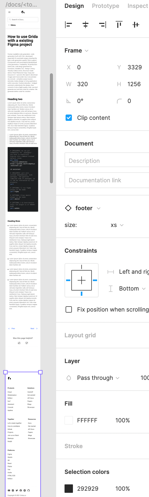

# Override bottom constraint if design is a long scrolling mockup.

Like this example we often design the footer to be constraint to bottom while the design. so it can look responsive vertically.

This is a wrong constraint, but not a wrong design strategy.
It must be ignored inside the code, unless the fotter will overlay all above layer when we run the app.

- h:10,000 design & footer on bottom
- actual h:812 runtime and bottom constraint to bottom
- footer will overlay all above top constraint elements.
